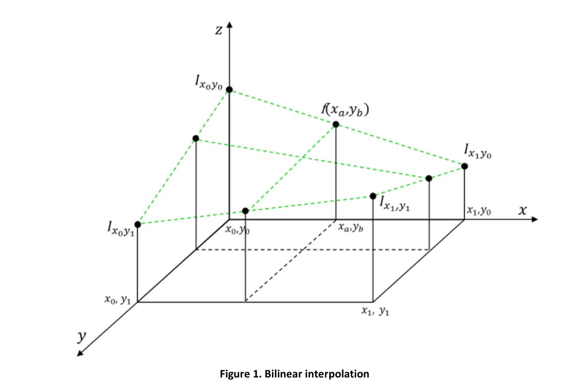
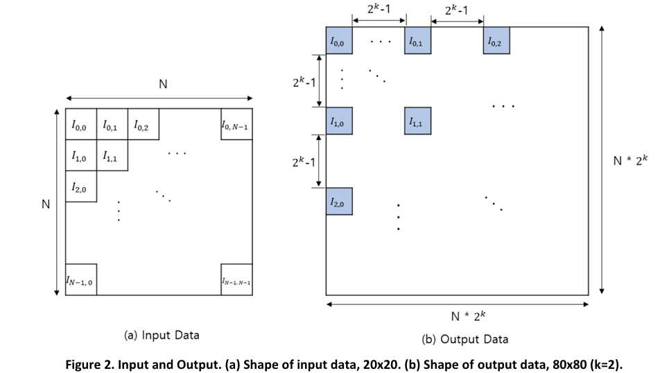
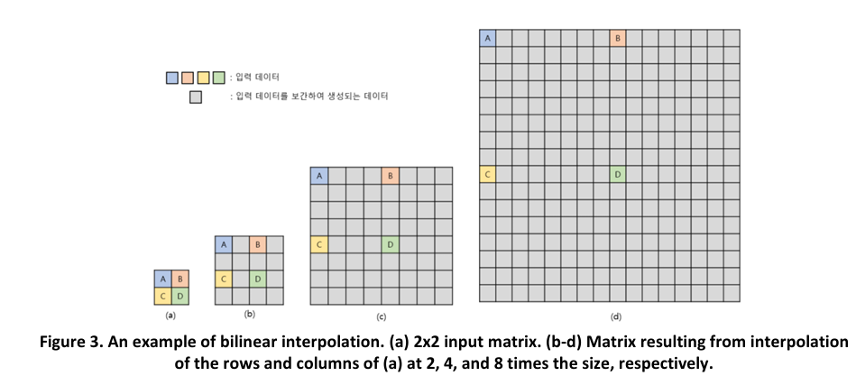

# Term Project. MNIST Image Upscaling with ARM Assembly

ARM 어셈블리(ARM Assembly)를 이용해 MNIST 숫자 이미지를 20×20에서 80×80으로 확대하는 프로젝트이다.

픽셀값은 IEEE 754 단정밀도(Single Precision) 형식으로 저장되어 있으며, 선형 보간(Bilinear Interpolation)을 기반으로 확대 이미지를 생성하도록 구현했다.

## Project Overview

이 프로젝트의 목표는 20×20 크기의 숫자 이미지 데이터를 80×80 크기로 확대하는 것이다.

단순 픽셀 복사가 아니라, 주변 4개 픽셀과 가중치를 이용해 새로운 픽셀값을 계산하는 선형 보간 방식을 적용했다.

```text
Input  : 20 × 20 MNIST digit image
Output : 80 × 80 upscaled image
Scale  : 4x
Format : IEEE 754 Single Precision
```

## Concept

## Concept

Bilinear Interpolation은 주변 4개 픽셀을 기준으로 새 픽셀값을 계산하는 방식이다.

아래 그림은 목표 좌표의 값을 주변 4개 픽셀값으로 보간하는 개념을 보여준다.

> Source: Assembly Term Project specification, Figure 1.



20×20 입력 이미지는 행과 열 방향으로 각각 4배 확대되어 80×80 결과 이미지가 된다.

아래 그림은 입력 데이터와 출력 데이터의 배치 구조를 보여준다.

> Source: Assembly Term Project specification, Figure 2.



아래 그림은 2×2 입력 행렬이 2배, 4배, 8배로 확대될 때 보간 픽셀이 어떻게 생성되는지 보여준다.

> Source: Assembly Term Project specification, Figure 3.



> 이미지 출처: 광운대학교 「어셈블리프로그래밍 설계 및 실습」 Term Project 과제 제안서, Figure 1~3.

## Core Algorithm

80×80 출력 이미지의 각 좌표를 기준으로 원본 20×20 이미지의 대응 좌표를 계산한다.

```text
x1 = output_row / 4
y1 = output_col / 4
dx = output_row % 4
dy = output_col % 4
```

이후 주변 4개 픽셀을 가져온다.

```text
Q11 = source[x1][y1]
Q12 = source[x1][y1 + 1]
Q21 = source[x1 + 1][y1]
Q22 = source[x1 + 1][y1 + 1]
```

최종 보간식은 다음 구조를 따른다.

```text
P = Q11 × (1 - dx) × (1 - dy)
  + Q12 × dx × (1 - dy)
  + Q21 × (1 - dx) × dy
  + Q22 × dx × dy
```

## Implementation Details

### 1. Output Image Loop

80×80 결과 버퍼를 순회하며 각 픽셀의 보간값을 계산한다.

```text
outer_loop : row index 0 ~ 79
inner_loop : column index 0 ~ 79
```

각 출력 좌표마다 원본 이미지 기준 좌표와 주변 픽셀을 계산한 뒤, 결과를 `ResultBuffer`에 저장한다.

### 2. Neighbor Pixel Load

출력 좌표에 대응되는 원본 좌표를 기준으로 `Q11`, `Q12`, `Q21`, `Q22` 값을 로드한다.

```text
Q11 : base pixel
Q12 : right pixel
Q21 : lower pixel
Q22 : lower-right pixel
```

각 픽셀은 원본 20×20 배열에서 word 단위로 접근한다.

### 3. Weight Calculation

`dx`, `dy`는 4배 확대 기준에서 나올 수 있는 나머지 값에 따라 가중치로 변환된다.

```text
0 → 0.00
1 → 0.25
2 → 0.50
3 → 0.75
```

이를 위해 다음 가중치 변환 서브루틴(Subroutine)을 구성했다.

```text
get_dx
get_dy
get_one_minus_dx
get_one_minus_dy
```

### 4. IEEE 754 Floating-Point Multiply

픽셀값과 가중치는 IEEE 754 단정밀도 값이므로 정수 곱셈처럼 바로 계산할 수 없다.

`multiply_float` 서브루틴에서는 다음 과정을 수행한다.

```text
1. zero, one 특수 케이스 확인
2. sign bit 추출
3. exponent 추출
4. mantissa 추출
5. hidden bit 복원
6. UMULL로 mantissa 곱셈
7. exponent bias 보정
8. normalization 수행
9. sign, exponent, mantissa 재조합
```

### 5. IEEE 754 Floating-Point Addition

보간식의 네 항을 누적하기 위해 `add_float` 서브루틴을 사용했다.

주요 처리 과정은 다음과 같다.

```text
1. sign bit 추출
2. exponent 비교
3. 작은 exponent 쪽 mantissa shift
4. sign에 따라 mantissa add/sub 수행
5. normalization 수행
6. IEEE 754 결과값 재조합
```

### 6. Result Store

계산된 80×80 결과 이미지는 `ResultBuffer`에 word 단위로 저장한다.

```text
ResultBuffer[row][col] = interpolated_pixel
```

## Main Subroutines

| 서브루틴                   | 역할                         |
| ---------------------- | -------------------------- |
| `get_dx`               | `dx` 값을 IEEE 754 가중치로 변환   |
| `get_dy`               | `dy` 값을 IEEE 754 가중치로 변환   |
| `get_one_minus_dx`     | `1 - dx` 가중치 계산            |
| `get_one_minus_dy`     | `1 - dy` 가중치 계산            |
| `bilinear_interpolate` | 주변 4개 픽셀과 가중치로 보간값 계산      |
| `multiply_float`       | IEEE 754 단정밀도 곱셈           |
| `add_float`            | IEEE 754 단정밀도 덧셈           |
| `normalize`            | mantissa 정규화 및 exponent 조정 |
| `end_program`          | 프로그램 종료                    |

## Verification

보고서에서는 다음 항목을 중심으로 디버깅을 수행했다.

```text
- Q11, Q12, Q21, Q22 픽셀 로드 확인
- dx, dy, 1-dx, 1-dy 가중치 계산 확인
- 곱셈 전 피연산자 로드 확인
- multiply_float의 zero case 확인
- add_float 수행 결과 확인
- ResultBuffer 저장 결과 확인
```

숫자 `0` 데이터에 대해서는 확대 이미지가 출력되는 것을 확인했다.

## Known Limitations

현재 제출본은 전체 구조와 핵심 연산 흐름을 구현했지만, 모든 숫자 이미지에 대해 완전한 보간 결과를 보장하지는 못했다.

보고서 기준으로 숫자 `0`의 출력은 확인했으나, 나머지 숫자에 대해서는 정상 출력까지 완성하지 못했다.

따라서 이 프로젝트는 완성형 이미지 업스케일러라기보다, ARM 어셈블리에서 Bilinear Interpolation과 IEEE 754 연산을 직접 구현한 실험적 구현물로 정리한다.

## File Structure

```text
TermProject/
├── README.md
├── project.s
├── memory.ini
├── report.pdf
└── assets/
    ├── input-output-structure.png
    └── bilinear-interpolation-example.png
```

## Execution Note

실행에는 Keil µVision 환경과 메모리 매핑 설정이 필요하다.

저장소에는 직접 작성한 `project.s`, 실행에 필요한 `memory.ini`, 결과 분석 보고서, 개념 설명용 이미지 자료만 포함한다.

수업에서 제공된 MNIST 데이터셋, 변환 유틸리티, 과제 명세서, skeleton 파일은 포함하지 않는다.

## Report

구현 접근 방식, 보간 알고리즘 설계, IEEE 754 곱셈/덧셈 처리 과정, 디버깅 결과는 `report.pdf`에 정리했다.

## Tech Stack

* ARM Assembly
* ARM9E-S
* Keil µVision
* Bilinear Interpolation
* IEEE 754 Single Precision
* Floating-Point Multiplication
* Floating-Point Addition
* Memory Buffer
* MNIST Image Data

## Summary

이 프로젝트는 ARM 어셈블리로 이미지 확대 알고리즘을 직접 구현한 프로젝트이다.

20×20 MNIST 이미지의 각 픽셀을 IEEE 754 부동소수점 값으로 처리하고, 주변 4개 픽셀과 가중치를 이용해 80×80 결과 이미지를 생성하도록 설계했다.

특히 단순한 반복문 구현을 넘어, 부동소수점 곱셈과 덧셈을 직접 분해·정규화·재조합하는 방식으로 처리했다는 점에서 레지스터 관리, 메모리 접근, 서브루틴 설계, 저수준 연산 흐름을 종합적으로 다룬 과제이다.
